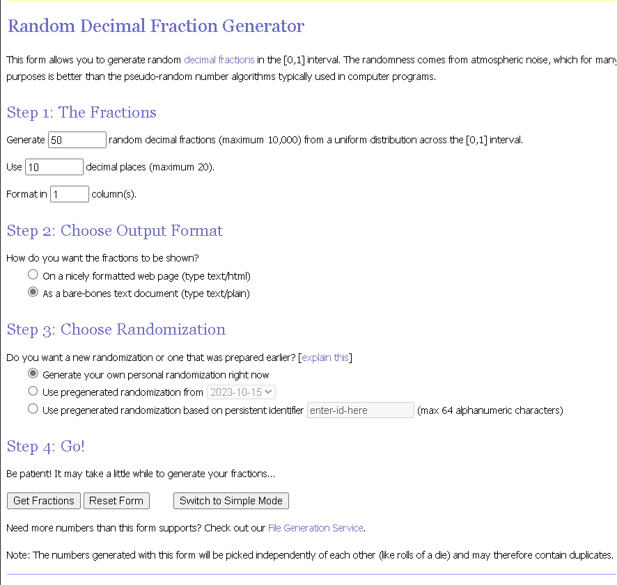

# Part 3: Turing bot application

The final component of the assignment concerns the use of the random function which is an intrinsic function of a Python library. The aim is to replace this function with one generated using the evolutionary computing (symbolic regression) system TuringBot. Thus, the aim is to use this system to produce a unique random number generator based on the nonlinear formula generated by the system, and, in doing so, replace the Python function‘random with this generator.
In this context the requirements are as follows:

    • Use https://www.random.org to produce a stream of random numbers in [0,1].
    • Use this sequence to seed the data for implementation of the TuringBot system to produce a unique nonlinear formula.
    • Use this ‘formula’ to generate a new function to replace function random.
    • Implement the result in regard to the Python app generated in Part2.

The random numbers were generated in the following way. Firstly, on the home page of random.org I selected Decimal Fractions Generator. Since the free version of the TuringBot application only allows input of a maximum of 50, I set the generator to generate 50 random decimal fractions, using the default 10 decimal places in a format of 1 column. Assuming we are already switched to advanced mode, I chose that the fractions be shown "As a bare-bones text document". After clicking "Get Fractions", I downloaded the generated text file. Below is a snapshot of the configuration.

After obtaining the generated fractions I then launched the TuringBot application. I only used ‘Basic’, ‘Trigonometric’, ‘Exponential’ and
‘Hyperbolic’ functions which are easily translatable into Python code. I avoided using the pow function to prevent overflow in the use of larger arrays. I inputted the input file generated by random.org using the input file option and ran the TuringBot application. After being satisfied by the generated functions, I halted the application. I then exported the solutions as a python file for later use.

Of the generated functions I chose one dubbed solution_16 as my random number generator. The function can be seen below.

    def solution_16(row):
        return 0.4713438069139883+(cos(1.941135162766205*((-2.611109827119532e+269)*(-0.0006088219598687469+row)))/4.186887236332272)

It was necessary to convert the inputted password into numbers if I were to use it in solution_16. This was accomplished with the following line of code:

    P=[ord(c) for c in input_password]

From this I put each unicode code point through solution_16 then multiplied by 100 to get a whole number around the length of characters used to construct the new password, using the modulo operator to loop back around if the number happened to be greater than the amount of characters available. Finally I rounded up to give an indexable number. 

    for i in P:
            password += characters[(math.ceil(solution_16(i)*100))%len(characters)]

The rest of the code remains similar to the code in Part 2.